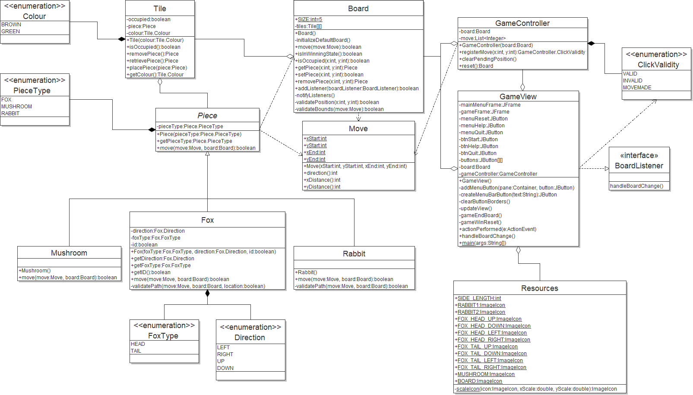
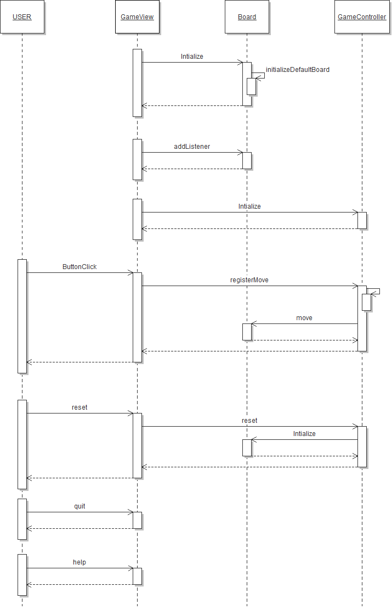

## Rabbits and Foxes

This GitHub repository is used for the development of a game based on JumpIN that follows the MVC design pattern.

## Development

##### Tools

- IDE: [Eclipse](https://www.eclipse.org/downloads/packages/release/2019-09/r/eclipse-ide-java-developers)
- JDK Version: [8](https://www.oracle.com/technetwork/java/javase/downloads/jdk8-downloads-2133151.html)
- UML: [Violet v0.16](http://www.horstmann.com/violet/violet-0.16c.jar)

##### Getting Started

1. From your terminal, run:
   ```bash
   git clone https://github.com/samuel-gamelin/SYSC-3110
   ```
   This will create a folder called SYSC-3110.
2. Open the Eclipse IDE, and click File -> Import.
3. Select Maven and then "Existing Maven Projects", then click Next.
4. Click Browse and select the SYSC-3110 folder that was just created. Click "Finish".

##### Rules for Contributions:

When contributing to the project please start on the issues page which is used for task tracking.

- Commits:
  - Only commit code to the corresponding milestone.
  - Please document your commits with changes and updates.
  - Add test cases for the updates made.
  - Merging to master will occur once every two weeks under the review of all developers on the project.
- Pull requests:
  - Open a pull request to the corresponding milestone.
  - Document your code.
  - If there are any conflicts during the merge please consult any developer on the team.
- Issues:
  - Issues will be used for task tracking.
  - When an issue is solved please document the changes that have been made.
  - Close the issue after you have commit your code.
  - If the issue is a bug please use Bug-<title> for the title
  - If the issue is a task please use Task-<title> for the title

##### Additional Tools

- Contributions are made through GitHub, on this repository.
  - Please download and install [git](https://git-scm.com/) and/or [GitHub Desktop](https://desktop.github.com/).
- Slack is used as the main chat for this project.
- Github Issues will be used for task and ticket tracking.

## Current Class Diagram

<p align="center">

</p>
Date: November 18, 2019

## Current Sequence Diagram

<p align="center">

</p>
Date: November 18, 2019

## Road Map

- Adding an undo/redo feature to the game and a hint system utilizing a game solver
  - Adding the ability to see the next best move on the game board
  - Incorporating an undo/redo to improve user experience
  - Updating and adding unit tests for the Model portion of the game
  - Continuing to implement gradual improvements
  - Continuing to document the development and design process

## Known issues

Currently no known issues are present.

> If you notice a bug, please add it to Issues tab. Make sure you include how to recreate the bug!

## New features

- Milestone 3: A solver for the game + undo/redo feature
    - An undo/redo moves feature to make solving puzzles easier
    - A hint system that can be used to get the next best move towards a solution
      - The hint system uses a BFS-algorithm to solve the current puzzle and suggest the next move towards a solution
    - 20 levels that can be played and completed, loaded from a JSON document

## The Team

- [Mohamed Radwan](https://github.com/MohamedRadwan)
- [Samuel Gamelin](https://github.com/samuel-gamelin)
- [Dani Hashweh](https://github.com/danihashweh)
- [John Breton](https://github.com/john-breton)
- [Abdalla El Nakla](https://github.com/Abdoltim)

## Documentation

Documentation for the project can be found [here](https://docs.google.com/document/d/1F1drMjR9mFtCsQivzpvqP5nMX2gI0osJu4_xSTUs74g/edit?usp=sharing).

## Credits for Graphical Resources

The pictures and graphical resources used in this game were obtained from https://www.smartgames.eu/uk/one-player-games/jumpin.

## License and Disclaimer

> This application is for educational purposes. JumpIN is a registered commercial product. The developers are not responsible for the distribution of this product.
