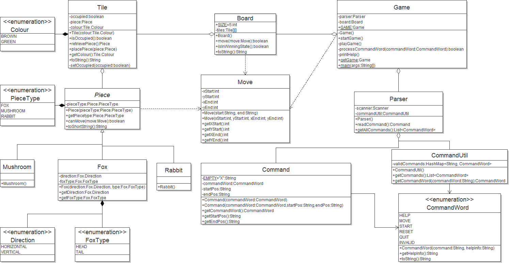

## JumpIN Game

This GitHub repo is used for the development of a JumpIN game that follows the MVC design pattern.

## Development

##### Tools

- IDE: [Eclipse](https://www.eclipse.org/downloads/packages/release/2019-09/r/eclipse-ide-java-developers)
- JDK Version: [8](https://www.oracle.com/technetwork/java/javase/downloads/jdk8-downloads-2133151.html)
- UML: [Violet v0.16](http://www.horstmann.com/violet/violet-0.16c.jar)

##### Getting Started

1.  From your terminal, run:
    ```bash
    git clone https://github.com/samuel-gamelin/SYSC-3110
    ```
    This will create a folder called SYSC-3110.
2.  Open the Eclipse IDE, and click File -> Open Projects from File System.
3.  From that window, click on the "Directory" button next to the "Import source" box, and select the "SYSC-3110" folder that was just created. Click "Finish".
4.  You will have to add JUnit 4 to your classpath to run the tests. To do so, right-click on the project name, then click "Build Path -> Add Libraries". Select JUnit, hit "Next", select JUnit 4 and click "Finish".

##### Rules for Contributions:

When contributing to the project please start on the issues page which is used for task tracking.

- Commits:
  - Only commit code to the corresponding milestone.
  - Please document your commits with changes and updates.
  - Add test cases for the updates made.
  - Merging to master will occur on weekly bases under the review of all developers on the project.
- Pull requests:
  - Open a pull request to the corresponding milestone.
  - Document your code.
  - If there are any conflicts during the merge please consult any developer on the team.
  - Please use the **merge and squash** option.
- Issues:
  - Issues will be used for task tracking.
  - When an issue is solved please document the changes that have been made.
  - Close the issue after you have commit your code.
  - If the issue is a bug please use Bug-<title> for the title
  - If the issue is a task please use Task-<title> for the title

##### Additional Tools

- Contributions are made through GitHub, on this repository.
  - Please download and install git and/or GitHub Desktop. [Download Link](https://git-scm.com/)
- Slack is used as the main chat for this project. [Invitation Link](https://www.google.ca)
- Github Issues will be used for task and ticket tracking.

## Current UML Diagram

<p align="center"> 

</p>
Date: October 16, 2019

## Current Sequence Diagram

<p align="center"> 

</p>
Date: October 16, 2019

## Road Map

- Create the model
  - Parse user input
  - Implement the board
  - Implement piece movements
  - Create the UML Diagram
  - Create the Sequence Diagram
  - Document the development and design process

## Known issues

Currently no known issues are present.

> If you notice a bug, please add it to Issues tab. Make sure you include how to recreate the bug!

## New features

- MileStone1: A fully playable text-based implementation of the game! 
    - Parsing user input
    - Moving pieces on the board
    - Displaying the board to the user
    - Identifying if a move is valid based on the game rules
    - Creating a board and setting pieces on said board
    - Proceeding with the game based on user input.
    - Ability to process if the user has solved the puzzle
    - Among other fundamental features necessary to ensure the game proceeds smoothly

## The Team

- [Mohamed Radwan](mailto:mohamedradwan@cmail.carleton.ca)
- [Samuel Gamelin](mailto:samuelgamelin@cmail.carleton.ca)
- [Dani Hashweh](mailto:danihashweh@cmail.carleton.ca)
- [John Breton](mailto:johnbreton@cmail.carleton.ca)
- [Abdalla El Nakla](mailto:abdallaelnakla@cmail.carleton.ca)

## Documentation

Documentation for the project can be found [here](https://docs.google.com/document/d/1F1drMjR9mFtCsQivzpvqP5nMX2gI0osJu4_xSTUs74g/edit?usp=sharing)

## License and Disclaimer

> This application is for educational purposes. JumpIN is a registered commercial product. The developers are not responsible for the distribution of this product.
