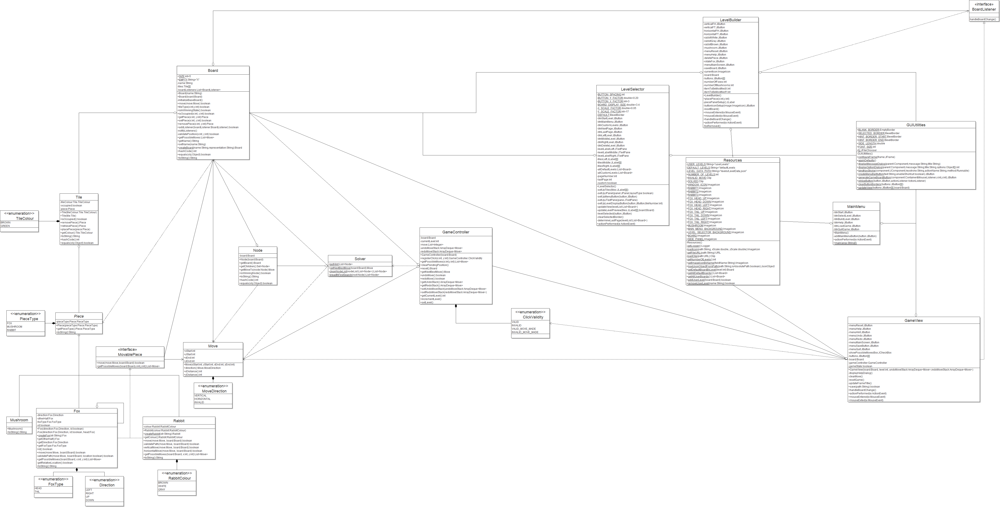

## Rabbits and Foxes

This GitHub repository is used for the development of a game based on JumpIN' that follows the MVC design pattern.

## Development

##### Tools

- IDE: <a href="https://www.eclipse.org/downloads/packages/release/2019-09/r/eclipse-ide-java-developers" target="_blank">Eclipse</a>,
<a href="https://www.jetbrains.com/idea/download/" target="_blank">IntelliJ IDEA</a>
- JDK Version: <a href="https://www.oracle.com/technetwork/java/javase/downloads/jdk8-downloads-2133151.html" target="_blank">8</a>
- Build Tool: <a href="https://maven.apache.org/download.cgi" target="_blank">Maven</a>
- UML: <a href="http://www.horstmann.com/violet/violet-0.16c.jar" target="_blank">Violet</a>

##### Getting Started

1. From your terminal, run:
   ```
   git clone https://github.com/samuel-gamelin/SYSC-3110
   ```
   This will create a folder called SYSC-3110.

2. Eclipse
    1. Open the Eclipse IDE, and click File -> Import.
    2. Select Maven and then Existing Maven Projects, then click Next.
    3. Click Browse and select the SYSC-3110 folder that was just created. Click Finish.
    
3. IntelliJ IDEA
    1. Open the IntelliJ IDEA IDE, and click File -> Open.
    2. Select the SYSC-3110 folder that was just created and click Open.

4. The entry point of the program is the main method of the MainMenu class under the ui package.
5. The project can be built by invoking a `mvn package` command from the project's root directory. This will generate a
runnable jar file in the target directory.

##### Additional Tools

- Contributions are made through GitHub, on this repository.
- GitHub issues will be used for task and ticket tracking.

## Current Class Diagram

<p style="text-align:right">

</p>
Date: December 2, 2019

## Current Sequence Diagram

<p style="text-align:right">

</p>
Date: December 2, 2019

## Known issues

Currently, attempting to save or delete a custom level while running the jar does not function correctly. This occurs because we are attempting to write to a file located within the jar during execution. This does not occur if the project is run through an IDE. A solution to this error would be to move the LevelData.json file to be outside of the jar. We apologize for this error.

> If you notice a bug, please add it to Issues tab. Make sure you include how to recreate the bug!

## Documentation

Documentation for the project can be found <a href="https://docs.google.com/document/d/1F1drMjR9mFtCsQivzpvqP5nMX2gI0osJu4_xSTUs74g/edit?usp=sharing" target="_blank">here</a>.

## The Team

- <a href="https://github.com/MohamedRadwan" target="_blank">Mohamed Radwan</a>
- <a href="https://github.com/samuel-gamelin" target="_blank">Samuel Gamelin</a>
- <a href="https://github.com/danihashweh" target="_blank">Dani Hashweh</a>
- <a href="https://github.com/john-breton" target="_blank">John Breton</a>
- <a href="https://github.com/Abdoltim" target="_blank">Abdalla El Nakla</a>

## Credits for Graphical Resources

The pictures and graphical resources used in this game were obtained <a href="https://www.smartgames.eu/uk/one-player-games/jumpin" target="_blank">here</a>.

## License and Disclaimer

> This application is for educational purposes. JumpIN' is a registered commercial product. The developers are not responsible for the distribution of this product.
