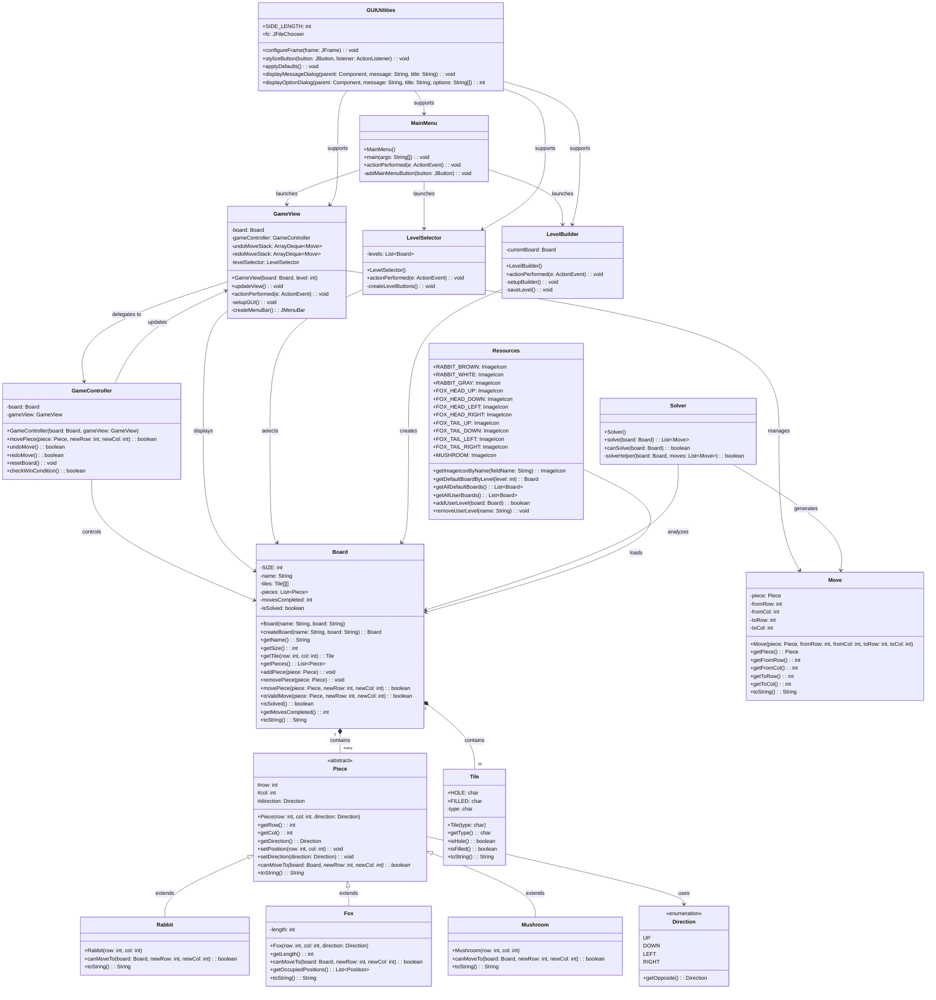

# Class Diagram

This diagram shows the class structure of the Rabbits and Foxes game following the MVC pattern.

```mermaid
classDiagram
    %% Model Classes
    class Board {
        -SIZE: int
        -name: String
        -tiles: Tile[][]
        -pieces: List~Piece~
        -movesCompleted: int
        -isSolved: boolean
        +Board(name: String, board: String)
        +createBoard(name: String, board: String): Board
        +getName(): String
        +getSize(): int
        +getTile(row: int, col: int): Tile
        +getPieces(): List~Piece~
        +addPiece(piece: Piece): void
        +removePiece(piece: Piece): void
        +movePiece(piece: Piece, newRow: int, newCol: int): boolean
        +isValidMove(piece: Piece, newRow: int, newCol: int): boolean
        +isSolved(): boolean
        +getMovesCompleted(): int
        +toString(): String
    }

    class Piece {
        <<abstract>>
        #row: int
        #col: int
        #direction: Direction
        +Piece(row: int, col: int, direction: Direction)
        +getRow(): int
        +getCol(): int
        +getDirection(): Direction
        +setPosition(row: int, col: int): void
        +setDirection(direction: Direction): void
        +canMoveTo(board: Board, newRow: int, newCol: int): boolean*
        +toString(): String*
    }

    class Rabbit {
        +Rabbit(row: int, col: int)
        +canMoveTo(board: Board, newRow: int, newCol: int): boolean
        +toString(): String
    }

    class Fox {
        -length: int
        +Fox(row: int, col: int, direction: Direction)
        +getLength(): int
        +canMoveTo(board: Board, newRow: int, newCol: int): boolean
        +getOccupiedPositions(): List~Position~
        +toString(): String
    }

    class Mushroom {
        +Mushroom(row: int, col: int)
        +canMoveTo(board: Board, newRow: int, newCol: int): boolean
        +toString(): String
    }

    class Tile {
        +HOLE: char
        +FILLED: char
        -type: char
        +Tile(type: char)
        +getType(): char
        +isHole(): boolean
        +isFilled(): boolean
        +toString(): String
    }

    class Direction {
        <<enumeration>>
        UP
        DOWN
        LEFT
        RIGHT
        +getOpposite(): Direction
    }

    %% Utility Classes
    class Move {
        -piece: Piece
        -fromRow: int
        -fromCol: int
        -toRow: int
        -toCol: int
        +Move(piece: Piece, fromRow: int, fromCol: int, toRow: int, toCol: int)
        +getPiece(): Piece
        +getFromRow(): int
        +getFromCol(): int
        +getToRow(): int
        +getToCol(): int
        +toString(): String
    }

    class Solver {
        +Solver()
        +solve(board: Board): List~Move~
        +canSolve(board: Board): boolean
        -solveHelper(board: Board, moves: List~Move~): boolean
    }

    %% View Classes
    class GameView {
        -board: Board
        -gameController: GameController
        -undoMoveStack: ArrayDeque~Move~
        -redoMoveStack: ArrayDeque~Move~
        -levelSelector: LevelSelector
        +GameView(board: Board, level: int)
        +updateView(): void
        +actionPerformed(e: ActionEvent): void
        -setupGUI(): void
        -createMenuBar(): JMenuBar
    }

    class LevelSelector {
        -levels: List~Board~
        +LevelSelector()
        +actionPerformed(e: ActionEvent): void
        -createLevelButtons(): void
    }

    class LevelBuilder {
        -currentBoard: Board
        +LevelBuilder()
        +actionPerformed(e: ActionEvent): void
        -setupBuilder(): void
        -saveLevel(): void
    }

    class MainMenu {
        +MainMenu()
        +main(args: String[]): void
        +actionPerformed(e: ActionEvent): void
        -addMainMenuButton(button: JButton): void
    }

    %% Controller Classes
    class GameController {
        -board: Board
        -gameView: GameView
        +GameController(board: Board, gameView: GameView)
        +movePiece(piece: Piece, newRow: int, newCol: int): boolean
        +undoMove(): boolean
        +redoMove(): boolean
        +resetBoard(): void
        +checkWinCondition(): boolean
    }

    %% Utility Classes
    class Resources {
        +RABBIT_BROWN: ImageIcon
        +RABBIT_WHITE: ImageIcon
        +RABBIT_GRAY: ImageIcon
        +FOX_HEAD_UP: ImageIcon
        +FOX_HEAD_DOWN: ImageIcon
        +FOX_HEAD_LEFT: ImageIcon
        +FOX_HEAD_RIGHT: ImageIcon
        +FOX_TAIL_UP: ImageIcon
        +FOX_TAIL_DOWN: ImageIcon
        +FOX_TAIL_LEFT: ImageIcon
        +FOX_TAIL_RIGHT: ImageIcon
        +MUSHROOM: ImageIcon
        +getImageIconByName(fieldName: String): ImageIcon
        +getDefaultBoardByLevel(level: int): Board
        +getAllDefaultBoards(): List~Board~
        +getAllUserBoards(): List~Board~
        +addUserLevel(board: Board): boolean
        +removeUserLevel(name: String): void
    }

    class GUIUtilities {
        +SIDE_LENGTH: int
        +fc: JFileChooser
        +configureFrame(frame: JFrame): void
        +stylizeButton(button: JButton, listener: ActionListener): void
        +applyDefaults(): void
        +displayMessageDialog(parent: Component, message: String, title: String): void
        +displayOptionDialog(parent: Component, message: String, title: String, options: String[]): int
    }

    %% Relationships
    Board "1" *-- "many" Piece : contains
    Board "1" *-- "25" Tile : contains
    Piece <|-- Rabbit : extends
    Piece <|-- Fox : extends
    Piece <|-- Mushroom : extends
    Piece --> Direction : uses

    GameController --> Board : controls
    GameController --> GameView : updates
    GameView --> Board : displays
    GameView --> GameController : delegates to
    GameView --> Move : manages

    LevelSelector --> Board : selects
    LevelBuilder --> Board : creates
    MainMenu --> GameView : launches
    MainMenu --> LevelSelector : launches
    MainMenu --> LevelBuilder : launches

    Solver --> Board : analyzes
    Solver --> Move : generates

    Resources --> Board : loads
    GUIUtilities --> GameView : supports
    GUIUtilities --> LevelSelector : supports
    GUIUtilities --> LevelBuilder : supports
    GUIUtilities --> MainMenu : supports
```

*Last updated: September 27, 2025*