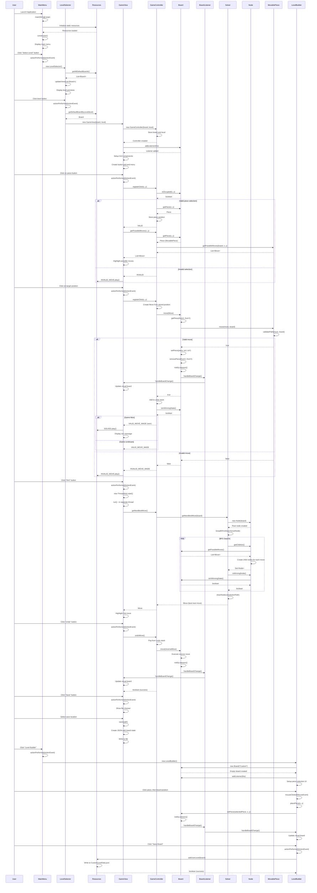

# Sequence Diagram

This diagram shows the actual interaction flow for a typical game session in the Rabbits and Foxes application.

```mermaid
sequenceDiagram
    participant User
    participant MainMenu
    participant LevelSelector
    participant Resources
    participant GameView
    participant GameController
    participant Board
    participant BoardListener
    participant Solver
    participant Node

    %% Application Start
    User->>MainMenu: Launch Application
    MainMenu->>MainMenu: main(String[] args)
    MainMenu->>Resources: Initialize static resources
    Resources-->>MainMenu: Resources loaded
    MainMenu->>MainMenu: constructor()
    MainMenu->>MainMenu: Display main menu

    %% Level Selection Flow
    User->>MainMenu: Click "Select Level" button
    MainMenu->>MainMenu: actionPerformed(ActionEvent)
    MainMenu->>LevelSelector: new LevelSelector()
    LevelSelector->>Resources: getAllDefaultBoards()
    Resources-->>LevelSelector: List<Board>
    LevelSelector->>LevelSelector: updateView(List<Board>)
    LevelSelector->>LevelSelector: Display level previews

    User->>LevelSelector: Click level button
    LevelSelector->>LevelSelector: actionPerformed(ActionEvent)
    LevelSelector->>Resources: getDefaultBoardByLevel(level)
    Resources-->>LevelSelector: Board
    LevelSelector->>GameView: new GameView(board, level)

    %% Game Initialization
    GameView->>GameController: new GameController(board, level)
    GameController->>GameController: Store board and level
    GameController-->>GameView: Controller created
    GameView->>Board: addListener(this)
    Board-->>GameView: Listener added
    GameView->>GameView: Setup GUI components
    GameView->>GameView: Create button grid and menu

    %% Game Play Loop - Piece Selection
    User->>GameView: Click on piece button
    GameView->>GameView: actionPerformed(ActionEvent)
    GameView->>GameController: registerClick(x, y)
    GameController->>Board: isOccupied(x, y)
    Board-->>GameController: boolean

    alt Valid piece selection
        GameController->>Board: getPiece(x, y)
        Board-->>GameController: Piece
        GameController->>GameController: Store piece position
        GameController-->>GameView: VALID
        GameView->>GameController: getPossibleMoves(x, y)
        GameController->>Board: getPiece(x, y)
        Board-->>GameController: Piece (MovablePiece)
        GameController->>MovablePiece: getPossibleMoves(board, x, y)
        MovablePiece-->>GameController: List<Move>
        GameController-->>GameView: List<Move>
        GameView->>GameView: Highlight possible moves
    else Invalid selection
        GameController-->>GameView: INVALID
        GameView->>Resources: INVALID_MOVE.play()
    end

    %% Game Play Loop - Move Execution
    User->>GameView: Click on target position
    GameView->>GameView: actionPerformed(ActionEvent)
    GameView->>GameController: registerClick(x, y)
    GameController->>GameController: Create Move from stored position
    GameController->>Board: move(Move)
    Board->>Board: getPiece(fromX, fromY)
    Board->>MovablePiece: move(move, board)
    MovablePiece->>MovablePiece: validatePath(move, board)

    alt Valid move
        MovablePiece-->>Board: true
        Board->>Board: setPiece(piece, toX, toY)
        Board->>Board: removePiece(fromX, fromY)
        Board->>Board: notifyListeners()
        Board->>BoardListener: handleBoardChange()
        BoardListener->>GameView: handleBoardChange()
        GameView->>GameView: Update visual board
        Board-->>GameController: true
        GameController->>GameController: Add to undo stack
        GameController->>Board: isInWinningState()
        Board-->>GameController: boolean

        alt Game Won
            GameController-->>GameView: VALID_MOVE_MADE (won)
            GameView->>Resources: SOLVED.play()
            GameView->>GameView: Display win message
        else Game continues
            GameController-->>GameView: VALID_MOVE_MADE
        end
    else Invalid move
        MovablePiece-->>Board: false
        Board-->>GameController: false
        GameController-->>GameView: INVALID_MOVE_MADE
        GameView->>Resources: INVALID_MOVE.play()
    end

    %% Hint System
    User->>GameView: Click "Hint" button
    GameView->>GameView: actionPerformed(ActionEvent)
    GameView->>GameView: new Thread(this).start()
    GameView->>GameView: run() - in separate thread
    GameView->>GameController: getNextBestMove()
    GameController->>Solver: getNextBestMove(board)
    Solver->>Node: new Node(board)
    Node-->>Solver: Root node created
    Solver->>Solver: breadthFirstSearch(rootNode)

    loop BFS Search
        Solver->>Node: getChildren()
        Node->>Board: getPossibleMoves()
        Board-->>Node: List<Move>
        Node->>Node: Create child nodes for each move
        Node-->>Solver: Set<Node>
        Solver->>Node: isWinningNode()
        Node->>Board: isInWinningState()
        Board-->>Node: boolean
        Node-->>Solver: boolean
    end

    Solver->>Solver: cleanNodeList(solutionPath)
    Solver-->>GameController: Move (best next move)
    GameController-->>GameView: Move
    GameView->>GameView: Highlight hint move

    %% Undo/Redo Operations
    User->>GameView: Click "Undo" button
    GameView->>GameView: actionPerformed(ActionEvent)
    GameView->>GameController: undoMove()
    GameController->>GameController: Pop from undo stack
    GameController->>Board: move(reverseMove)
    Board->>Board: Execute reverse move
    Board->>Board: notifyListeners()
    Board->>BoardListener: handleBoardChange()
    BoardListener->>GameView: handleBoardChange()
    GameView->>GameView: Update visual board
    GameController-->>GameView: boolean (success)

    %% Save Game
    User->>GameView: Click "Save" button
    GameView->>GameView: actionPerformed(ActionEvent)
    GameView->>GameView: Show file chooser
    User->>GameView: Select save location
    GameView->>GameView: save(path)
    GameView->>GameView: Create JSON with board state
    GameView->>GameView: Write to file

    %% Level Builder Flow
    User->>MainMenu: Click "Level Builder"
    MainMenu->>MainMenu: actionPerformed(ActionEvent)
    MainMenu->>LevelBuilder: new LevelBuilder()
    LevelBuilder->>Board: new Board("Custom")
    Board-->>LevelBuilder: Empty board created
    LevelBuilder->>Board: addListener(this)
    LevelBuilder->>LevelBuilder: Setup piece selection UI

    User->>LevelBuilder: Click piece, then board position
    LevelBuilder->>LevelBuilder: mouseClicked(MouseEvent)
    LevelBuilder->>LevelBuilder: placePiece(x, y)
    LevelBuilder->>Board: setPiece(selectedPiece, x, y)
    Board->>Board: notifyListeners()
    Board->>BoardListener: handleBoardChange()
    BoardListener->>LevelBuilder: handleBoardChange()
    LevelBuilder->>LevelBuilder: Update visual board

    User->>LevelBuilder: Click "Save Board"
    LevelBuilder->>LevelBuilder: actionPerformed(ActionEvent)
    LevelBuilder->>Resources: addUserLevel(board)
    Resources->>Resources: Write to CustomLevelData.json
    Resources-->>LevelBuilder: boolean (success)
```

*Last updated: September 27, 2025*