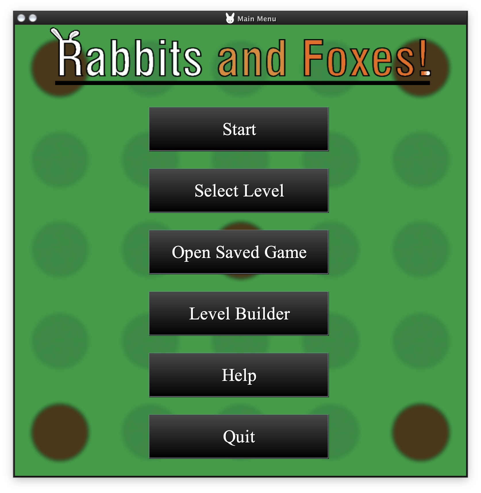
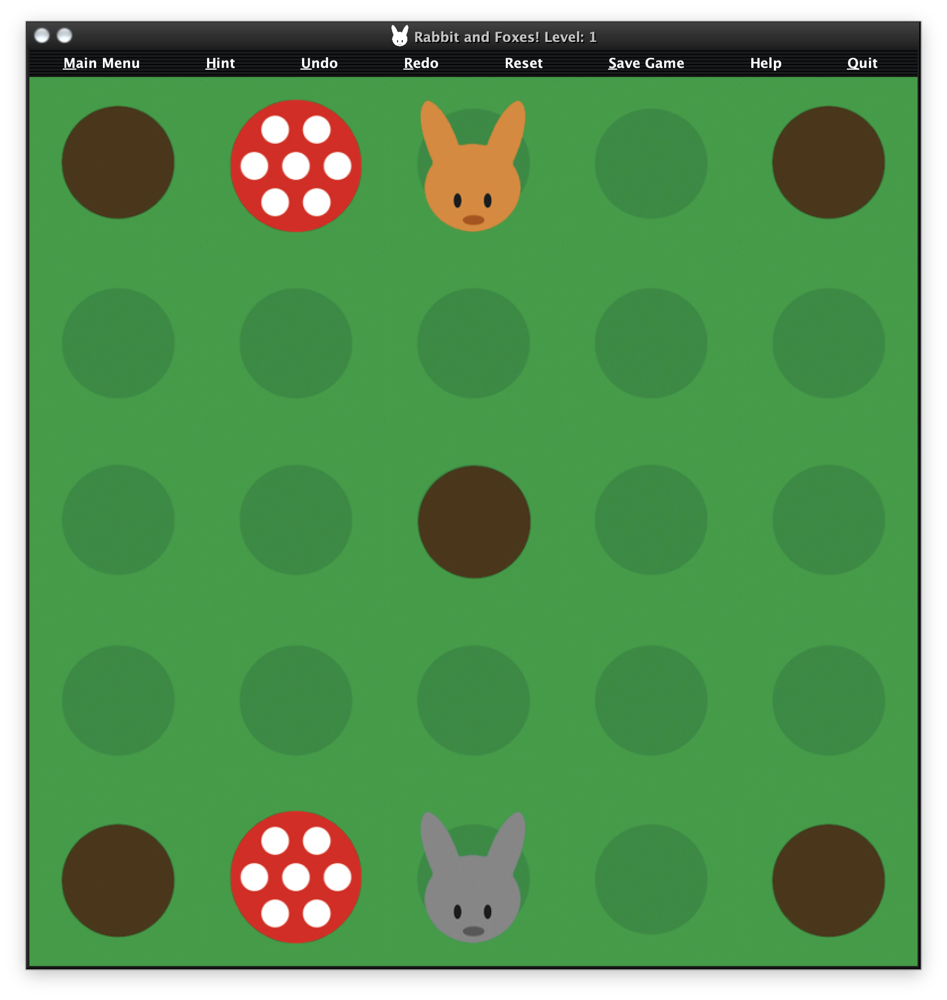
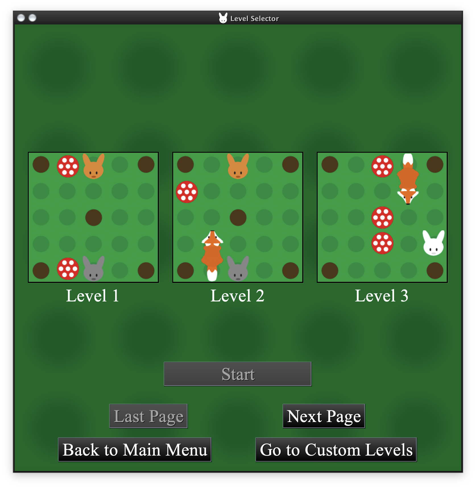
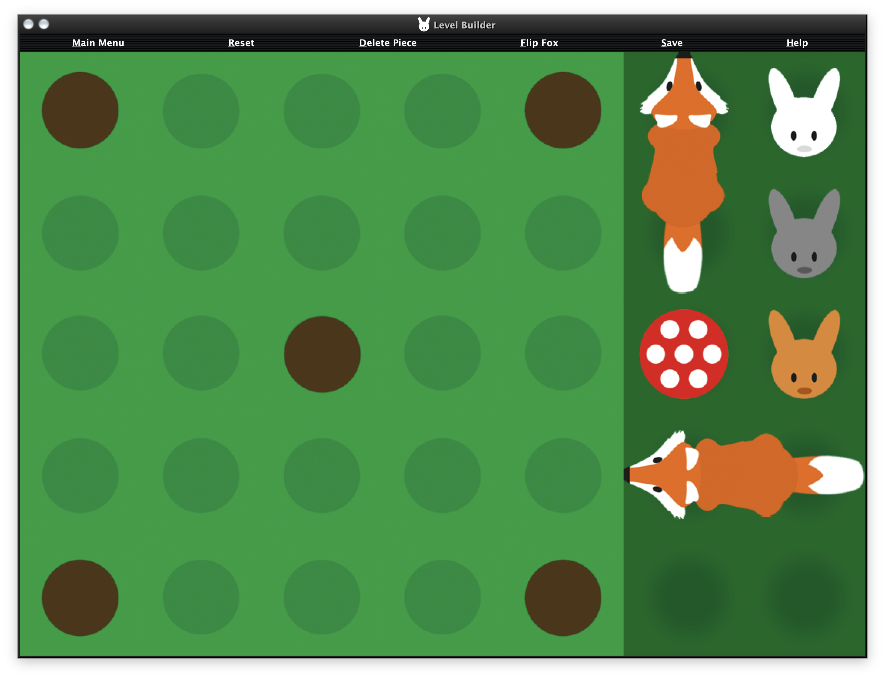

# Rabbits and Foxes - User Manual and Design Decisions

## Table of Contents

1. [How to Run the Application](#how-to-run-the-application)
2. [How to Play](#how-to-play)
3. [Level Selector](#level-selector)
4. [Level Builder](#level-builder)
5. [The Team](#the-team)
6. [Development Methodology](#development-methodology)
7. [Design Decisions](#design-decisions)
   - [7.1 MVC Design Pattern](#71-mvc-design-pattern)
   - [7.2 Class Hierarchy](#72-class-hierarchy)
   - [7.3 Solver Algorithm](#73-solver-algorithm)

---

## How to Run the Application

The Rabbits and Foxes game can be run in several ways:

### Prerequisites
- Java 21 or higher
- Maven (for building from source)

### Option 1: Using the Pre-built JAR
1. Download the latest `Rabbits-and-Foxes.jar` from the releases
2. Run the following command:
   ```bash
   java -jar Rabbits-and-Foxes.jar
   ```

### Option 2: Building from Source
1. Clone the repository:
   ```bash
   git clone https://github.com/samuel-gamelin/Rabbits-and-Foxes.git
   cd Rabbits-and-Foxes
   ```

2. Build the project:
   ```bash
   mvn clean package
   ```

3. Run the generated JAR:
   ```bash
   java -jar target/Rabbits-and-Foxes.jar
   ```

### Option 3: IDE Development
1. Open the project in IntelliJ IDEA or Eclipse
2. Ensure Lombok plugin is installed and configured
3. Run the `main` method in `ui.MainMenu` class

---

## How to Play

Rabbits and Foxes is a puzzle game based on the popular JumpIN' board game. The objective is to get all the rabbits into the holes on the board.



### Game Objective
- **Goal**: Move all rabbits into the holes (marked positions on the board)
- **Challenge**: Navigate around foxes and mushrooms that block your path
- **Strategy**: Plan your moves carefully as some moves may block future solutions

### Basic Gameplay



#### Piece Types
- **Rabbits**: Can move horizontally or vertically until they hit an obstacle or the edge of the board. Rabbits must land in holes to win the level.
- **Foxes**: Two-piece animals (head and tail) that move as a single unit, can slide horizontally or vertically in the direction they're facing
- **Mushrooms**: Static obstacles that cannot be moved and block piece movement

#### How to Move
1. **Select a Piece**: Click on a rabbit or fox to select it
   - When hovering over a square, it will show a border indicating it can be selected
   - Selected pieces are highlighted with a **red border**
2. **Choose Destination**: Click on a valid destination square
3. **Movement Rules**:
   - Pieces slide until they hit an obstacle or board edge
   - You cannot stop a piece mid-slide
   - Pieces cannot jump over other pieces
   - Invalid moves will play an audio cue to alert the player

#### Visual Feedback
- **Hover Effect**: Squares show a border when the mouse hovers over them
- **Selection**: Selected pieces have a **red border** around them
- **Hint System**: When a hint is requested:
  - Starting square has a **yellow border**
  - Landing square has a **green border**
- **Clear Selection**: Press **ESC** to clear the current selection

#### Keyboard Shortcuts
- **R**: Redo the last undone move
- **U**: Undo the last move
- **H**: Request a hint for the next best move
- **ESC**: Clear current piece selection

#### Game Controls
- **Reset**: Restart the current level
- **Hint**: Get a suggestion for the next move using the built-in solver
- **Undo/Redo**: Navigate through your move history (undo clears redo stack if new move is made)
- **Save**: Save your current progress to a file for later loading
- **Menu**: Return to the main menu
- **Show Possible Moves**: Toggle to highlight valid moves for selected pieces

#### Winning
The level is complete when all rabbits are positioned in holes. A success message will appear with options to:
- Move to the next level
- Reset the current level
- Quit the game

#### Save and Load
- **Save Game**: Save your current progress including move history and board state
- **Load Game**: Resume a previously saved game from the main menu

---

## Level Selector



The Level Selector allows you to choose from pre-built levels or custom levels created in the Level Builder.

### Features
- **Default Levels**: 20 pre-built puzzles with gradually increasing difficulty
- **Custom Levels**: User-created levels from the Level Builder
- **Level Preview**: Visual preview of each level before playing with level name
- **Navigation**: Browse through multiple pages of levels using Next/Previous buttons
- **Difficulty Progression**: Levels are arranged from easiest to most challenging
- **Level Management**: Delete custom levels (default levels cannot be deleted)

### How to Use
1. Select "Select Level" from the main menu
2. Use the navigation buttons to browse available levels
3. Click on a level preview to select it, then click "Start Level"
4. Toggle between "Default Levels" and "Custom Levels" using the buttons
5. Use "Delete Level" to remove custom levels you no longer want
6. If no custom levels exist, you'll be prompted to create some using the Level Builder

### Level Completion
Once all 20 default levels are completed, players can:
- Return to the main menu
- Quit the game
- Continue playing custom levels

---

## Level Builder



The Level Builder allows you to create custom puzzle levels.

### Features
- **Piece Placement**: Select pieces and click on the board to place them
- **Piece Library**: Choose from rabbits, foxes, and mushrooms
- **Board Validation**: Automatically ensures your level is solvable using the built-in solver
- **Save Custom Levels**: Store your creations for later play
- **Real-time Preview**: See your level as you build it

### Piece Constraints
The Level Builder enforces the following limits to maintain game balance:
- **Maximum 3 Rabbits**: Ensures reasonable puzzle complexity
- **Maximum 3 Mushrooms**: Limits static obstacles
- **Maximum 2 Foxes**: Controls movable obstacles (each fox consists of head + tail)

### How to Create a Level
1. Select "Level Builder" from the main menu
2. Choose a piece type from the piece selection panel
3. Click on board squares to place the selected piece
4. Use "Delete Piece" to remove incorrectly placed pieces
5. Use "Flip Fox" to change fox orientation
6. Click "Save Board" when your level is complete
7. Give your level a unique name (subject to validation rules)
8. Your level will be available in the Level Selector under "Custom Levels"

### Level Validation
When saving a custom level, the system performs several checks:
- **Solvability**: Uses the Solver class to verify the level can be completed
- **Name Validation**: Level names must be unique and cannot contain numbers
- **Unsolvable Warning**: If your level cannot be solved, you'll be notified

### Design Tips
- Ensure there are enough holes for all rabbits
- Create interesting obstacles with foxes and mushrooms
- Test your level to ensure it's solvable and fun
- Consider multiple solution paths for engaging gameplay
- Long level names may be truncated in the display to maintain consistent formatting

---

## The Team

This project was developed by a collaborative team of Software Engineering students at Carleton University:

- **[Mohamed Radwan](https://github.com/MohamedRadwan)** - Lead Developer
- **[Samuel Gamelin](https://github.com/samuel-gamelin)** - Project Manager & Developer
- **[Dani Hashweh](https://github.com/danihashweh)** - UI/UX Developer
- **[John Breton](https://github.com/john-breton)** - Algorithm Developer
- **[Abdalla El Nakla](https://github.com/Abdoltim)** - Quality Assurance

Each team member contributed their expertise to create a polished, educational implementation of the JumpIN' puzzle game. The team collaborated effectively using agile methodologies and modern software development practices.

---

## Development Methodology

### Agile Development Process
The team followed a **Scrum and Agile development methodology** with the following practices:

#### Project Phases
The development was structured in four major milestones:

1. **Milestone 1**: Model implementation with text-based gameplay
2. **Milestone 2**: Complete GUI implementation (View and Controller)
3. **Milestone 3**: Solver algorithm and utility classes
4. **Milestone 4**: Enhanced GUI, save/load functionality, and level management

#### Sprint Planning
- **Sprint Duration**: 2-week development cycles
- **Standup Meetings**: Two weekly meetings to discuss progress, completed tasks, and blockers
- **Task Distribution**: Work divided based on individual strengths and interests
- **GitHub Issues**: Tasks assigned and tracked as GitHub Issues

#### Team Collaboration
- **Knowledge Sharing**: Team members explained decisions and implementations to ensure everyone stayed informed
- **Code Reviews**: Regular team meetings for code review after small updates
- **Refactoring**: Continuous code improvement to maintain quality standards
- **Cross-Class Development**: Members occasionally worked on other classes when integration was needed

#### UML Design Process
- **Initial Planning**: First week dedicated to UML design with multiple team meetings
- **Multiple Drafts**: Several UML iterations before settling on final design
- **Evolutionary Design**: UML updated throughout development as program needs evolved
- **Best Practices**: Final design incorporates established software design principles

#### Version Control
- **Git Workflow**: Feature branch strategy with pull request reviews
- **Repository**: [GitHub - Rabbits-and-Foxes](https://github.com/samuel-gamelin/Rabbits-and-Foxes)
- **Issue Tracking**: GitHub Issues for bug tracking and feature requests
- **Agile Development**: GitHub used for agile development ensuring all commits could be reviewed and modified

#### Code Quality
- **Code Reviews**: All changes reviewed by at least one other team member
- **Testing**: Unit tests for core game logic
- **Documentation**: Comprehensive JavaDoc comments and architectural diagrams
- **Continuous Improvement**: Regular refactoring to improve code being pushed to consumers

#### Tools and Technologies
- **Language**: Java 21
- **Build Tool**: Maven
- **IDE**: IntelliJ IDEA, Eclipse (with Lombok plugin)
- **UI Framework**: Java Swing
- **Libraries**: Lombok for boilerplate reduction, Gson for JSON processing
- **CI/CD**: GitHub Actions for automated testing
- **Documentation**: Mermaid for UML diagrams

---

## Design Decisions

### 7.1 MVC Design Pattern

The application follows the **Model-View-Controller (MVC)** architectural pattern to ensure separation of concerns and maintainability.

#### Model Layer
- **`Board`**: Represents the game state and board configuration
- **`Piece` hierarchy**: Abstract representation of game pieces (Rabbit, Fox, Mushroom)
- **`Move`**: Encapsulates movement operations
- **`Solver`**: Implements puzzle-solving algorithms

#### View Layer
- **`GameView`**: Main game interface displaying the board and controls
- **`MainMenu`**: Application entry point and navigation
- **`LevelSelector`**: Level browsing and selection interface
- **`LevelBuilder`**: Custom level creation interface

#### Controller Layer
- **`GameController`**: Manages game logic, move validation, and state transitions
- **Event Handlers**: Process user input and coordinate between model and view

#### Benefits of MVC
- **Modularity**: Each layer has distinct responsibilities
- **Testability**: Business logic can be tested independently of UI
- **Maintainability**: Changes to one layer don't require changes to others
- **Scalability**: Easy to extend with new features or UI components

### 7.2 Class Hierarchy

#### Piece Inheritance Structure
```
Piece (abstract)
├── Rabbit (implements MovablePiece)
├── Fox (implements MovablePiece)
└── Mushroom
```

#### Design Rationale
- **Abstract Base Class**: `Piece` provides common functionality and type safety
- **MovablePiece Interface**: Separates movable pieces from static obstacles
- **Polymorphism**: Enables uniform handling of different piece types
- **Extensibility**: Easy to add new piece types without modifying existing code

#### Key Interfaces
- **`MovablePiece`**: Defines movement behavior for interactive pieces
- **`BoardListener`**: Observer pattern for board state changes
- **Enables loose coupling between game components**

### 7.3 Solver Algorithm

The game includes an intelligent hint system powered by a **Breadth-First Search (BFS)** algorithm.

#### Algorithm Implementation
```java
public class Solver {
    // Finds optimal solution path using BFS
    private List<Node> breadthFirstSearch(Node root) {
        // Implementation details in codebase
    }
}
```

#### Features
- **Optimal Solutions**: BFS guarantees the shortest solution path
- **State Space Exploration**: Systematically explores all possible game states
- **Hint Generation**: Provides next best move for players who are stuck
- **Performance Optimization**: Efficient node management and pruning

#### Algorithm Benefits
- **Completeness**: Will find a solution if one exists
- **Optimality**: Guarantees minimum number of moves
- **Educational Value**: Demonstrates AI problem-solving techniques
- **User Experience**: Helps players learn optimal strategies

#### Technical Implementation
- **Node Representation**: Each game state is represented as a tree node
- **Move Generation**: All valid moves are computed for each state
- **Goal Detection**: Winning states are identified efficiently
- **Path Reconstruction**: Solution path is traced back from goal to start

### 7.4 Detailed Class Design

#### Core Model Classes

**GameController**
- Connects the View and Model layers following MVC pattern
- Manages user input registration and click validation
- Maintains move history using two stacks (undo/redo functionality)
- Handles board reset by creating new board objects
- Integrates with the Solver for hint generation

**GameView**
- Primary view class managing the entire application GUI
- Implements multiple layouts: BoxLayout for main menu, GridLayout for game board, BorderLayout for level selector
- Handles all button events and user interactions
- Uses `setLookAndFeel()` for cross-platform consistency
- Implements audio processing with Clips for invalid moves and victory sounds
- Registers MouseListeners for hover effects and selection borders
- Supports keyboard bindings for accessibility (R, U, H, ESC keys)
- Implements BoardListener pattern for automatic GUI updates

**Board**
- Central model class managing the 5x5 game grid using a 2D array structure
- Maintains list of BoardListeners for state change notifications
- Provides utility methods for piece placement, removal, and position queries
- Implements winning state detection logic
- Features static factory methods for level loading from JSON representation
- Delegates string representation to Tile class for save functionality

**Piece Hierarchy**
- **Abstract Piece**: Base class providing common functionality and PieceType enum
- **MovablePiece Interface**: Defines movement behavior for interactive pieces
- **Rabbit**: Implements horizontal/vertical movement with color variations (Brown, White, Gray)
- **Fox**: Complex two-piece implementation with direction and type (Head/Tail) management
- **Mushroom**: Static obstacle implementation

#### Utility and Support Classes

**Resources**
- Uninstantiable utility class for resource management
- Provides static access to ImageIcons and audio Clips
- Integrates Gson library for JSON level processing
- Manages both default and user-created level collections

**BoardListener Interface**
- Defines observer pattern for board state changes
- Enables loose coupling between model and view components

**Move Class**
- Immutable value object (final class with final fields)
- Encapsulates movement operations with start/end positions
- Provides utility methods for direction and distance calculations

**Solver and Node**
- **Solver**: Implements BFS algorithm for optimal solution finding
- **Node**: Represents game states in the search tree
- Provides next best move functionality for hint system

**GUIUtilities**
- Shared utility functions for GUI components
- Manages display constants and font sizing
- Provides methods for component configuration and event binding

#### Advanced Features

**LevelBuilder**
- Interactive level creation with piece placement validation
- Enforces game balance constraints (3 rabbits, 3 mushrooms, 2 foxes)
- Integrates with Solver to verify level solvability before saving
- Implements name validation (unique names, no numbers)

**LevelSelector**
- Multi-page navigation for level browsing
- Supports both default and custom level management
- Provides level preview functionality with visual representations
- Implements custom level deletion (protects default levels)

**MainMenu**
- Application entry point with proper frame disposal
- Dispatches appropriate UI components based on user selection
- Integrates help dialogs and file chooser for saved games

---

## Credits and License

### Graphical Resources
The images and graphical resources used in this game were obtained from [SmartGames JumpIN'](https://www.smartgames.eu/uk/one-player-games/jumpin).

### License and Disclaimer
> This application is for educational purposes. JumpIN' is a registered commercial product. The developers are not responsible for the distribution of this product.

---

*Last updated: September 27, 2025*